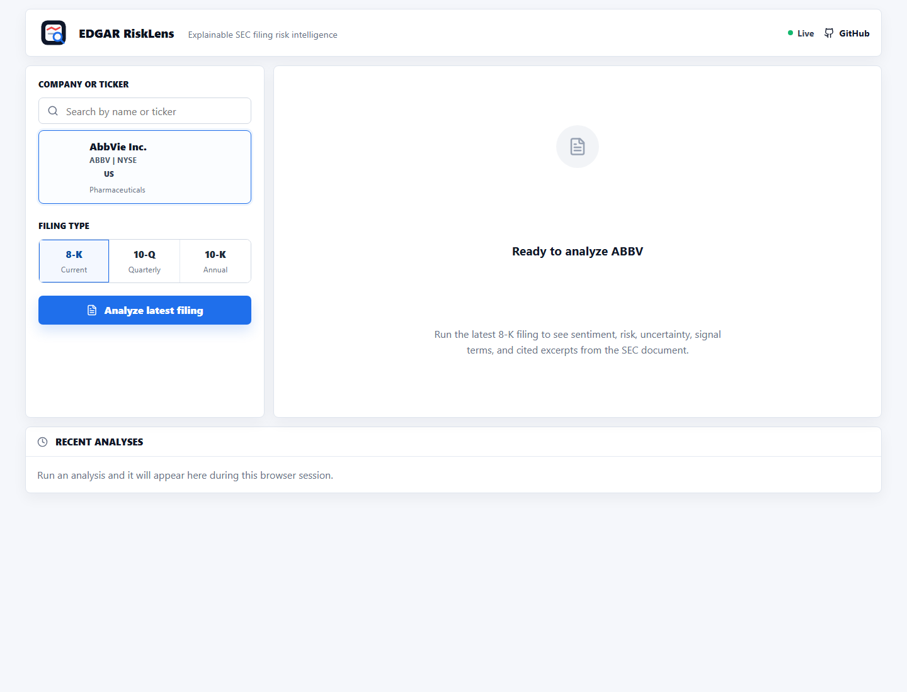
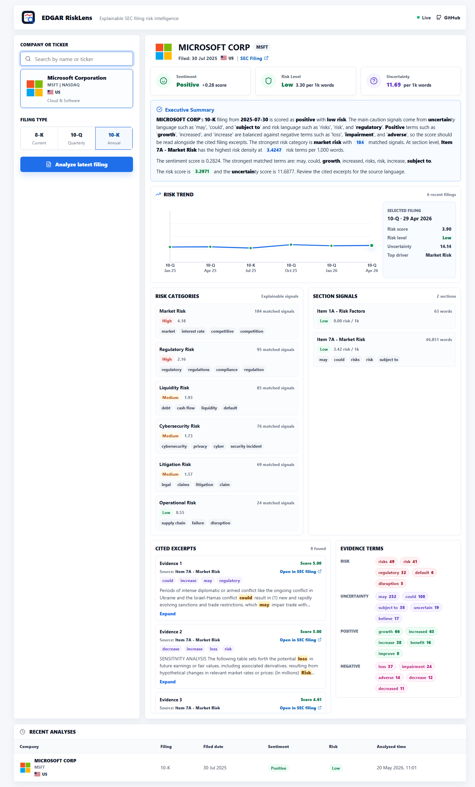
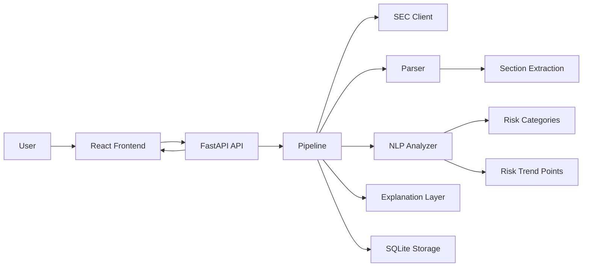

# EDGAR RiskLens

A focused full-stack project that analyzes public SEC filings for sentiment, uncertainty, and risk.

The project keeps a professional folder structure without overengineering. Each backend folder has one clear job, and the code is meant to be readable for beginner-to-mid-level developers.

## Live Demo

- **Website:** [https://edgar-risklens.netlify.app](https://edgar-risklens.netlify.app)
- **Backend health check:** [https://edgar-risklens-api.onrender.com/health](https://edgar-risklens-api.onrender.com/health)

## Screenshots

**Dashboard**



**Completed Microsoft 10-K analysis**



## What It Does

- Fetches the latest SEC filing for a ticker.
- Cleans SEC filing HTML into readable text.
- Scores sentiment, risk, and uncertainty using simple finance word lists.
- Extracts major filing sections such as Risk Factors and MD&A when present.
- Breaks risk into categories such as litigation, regulatory, liquidity, market, cybersecurity, and operational risk.
- Tracks recent filing risk scores in a timeline chart so users can see whether risk is rising, falling, or stable.
- Extracts supporting excerpts from the filing.
- Highlights matched terms inside cited excerpts.
- Adds a plain-English explanation.
- Saves analysis results in SQLite.
- Displays the output in a React frontend.
- Lets users select 100 popular US, UK, European, and global companies from a searchable menu with ticker, sector, exchange, and logo.
- Supports common US issuer forms (`8-K`, `10-Q`, `10-K`) and foreign issuer forms (`6-K`, `20-F`).

## Frameworks Used

- **FastAPI backend:** typed Python API for filing analysis requests.
- **React + TypeScript frontend:** clean dashboard for selecting companies and reviewing results.
- **SEC EDGAR ingestion:** live filing fetches from public SEC sources.
- **NLP scoring:** finance-focused word lists for sentiment, risk, and uncertainty signals.
- **Risk scoring + explainability:** per-1,000-word risk density, risk categories, cited excerpts, and section-level signals.
- **Optional LLM explanations:** template explanations by default, with optional OpenAI support.
- **SQLite storage:** lightweight persistence for completed analysis results.
- **Docker + CI:** reproducible local runs and automated checks.

## How The Scores Work

Risk and uncertainty scores are not `0-1` probabilities. They are language-density scores:

```text
score = matched term count / total words * 1,000
```

So a risk score of `6.00` means the filing contains about six matched risk terms per 1,000 words. The uncertainty score uses the same calculation, but counts uncertainty terms such as `may`, `could`, `uncertain`, and `subject to`.

Current risk-level thresholds:

```text
Low:    below 5 risk terms per 1,000 words
Medium: 5 to below 12 risk terms per 1,000 words
High:   12 or more risk terms per 1,000 words
```

This makes the baseline explainable: users can see the score, the matched terms, and the filing excerpts behind the result.

## Architecture



## Project Structure

```text
.
|-- .github/workflows/ci.yml
|-- data/.gitkeep
|-- docs/architecture.md
|-- frontend/
|   |-- public/flags/
|   |-- public/logos/
|   |-- src/components/
|   |-- src/api/
|   |-- src/data/companies.ts
|   |-- src/utils/
|   |-- src/App.tsx
|-- src/sec_sentiment/
|   |-- api/
|   |-- clients/
|   |-- ingestion/
|   |-- llm/
|   |-- models/
|   |-- nlp/
|   |-- parsing/
|   |-- pipeline/
|   |-- storage/
|   |-- __init__.py
|   |-- config.py
|   `-- main.py
|-- tests/
|-- .env.example
|-- Dockerfile
|-- docker-compose.yml
|-- pyproject.toml
`-- README.md
```

## Backend Setup

```bash
python -m venv .venv
pip install -e ".[dev]"
cp .env.example .env
uvicorn sec_sentiment.main:app --reload
```

Windows PowerShell:

```powershell
python -m venv .venv
.venv\Scripts\Activate.ps1
pip install -e ".[dev]"
Copy-Item .env.example .env
uvicorn sec_sentiment.main:app --reload
```

Backend health check:

```text
http://127.0.0.1:8000/health
```

## Frontend Setup

```bash
cd frontend
npm install
npm run dev
```

Frontend URL:

```text
http://127.0.0.1:5173
```

## Docker

```bash
docker compose up --build
```

Docker URLs:

```text
Frontend: http://localhost:3000
Backend:  http://localhost:8000
```

## Environment Variables

```env
SEC_USER_AGENT="Your Name your.email@example.com"
EXPLANATION_PROVIDER=template
OPENAI_API_KEY=
OPENAI_MODEL=gpt-4.1-mini
SQLITE_PATH=data/sec_sentiment.db
```

`EXPLANATION_PROVIDER=template` works without an API key. Use `openai` only if you want the optional LLM explanation layer.

## Tests

```bash
pytest
```

## Note

This is not investment advice and does not predict stock prices. It is a practical NLP project for reading public financial documents and producing explainable analysis.
