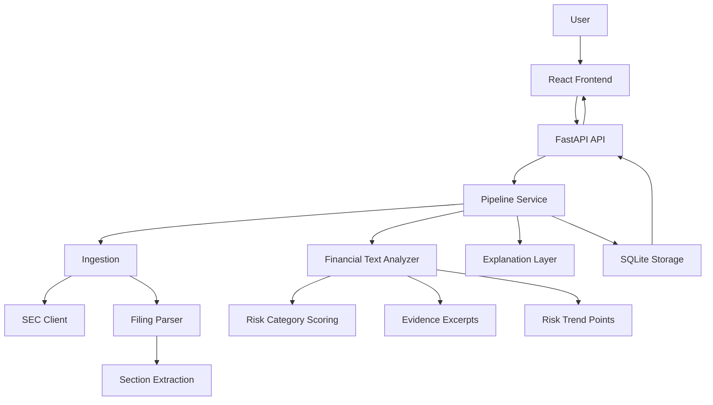

# Architecture

This repo uses a simple layered backend and a separate React frontend.

## Backend Folders

| Folder | Purpose |
| --- | --- |
| `api/` | FastAPI app and routes. |
| `clients/` | External SEC EDGAR client. |
| `ingestion/` | Fetches and prepares SEC filings. |
| `llm/` | Template and optional OpenAI explanations. |
| `models/` | Pydantic request and response models. |
| `nlp/` | Sentiment, risk, uncertainty, risk category scoring, and evidence extraction. |
| `parsing/` | HTML-to-text parsing and major SEC section extraction. |
| `pipeline/` | Coordinates the end-to-end workflow. |
| `storage/` | SQLite persistence. |

The structure is production-aware but intentionally small. Each folder has one main file so the project stays easy to follow.

## Risk Trend Flow

The frontend calls `/api/v1/filings/risk-trend` after a filing analysis finishes. The backend fetches a small number of recent filings, scores each filing with the same analyzer, and returns lightweight chart points instead of full evidence for every historical filing.
