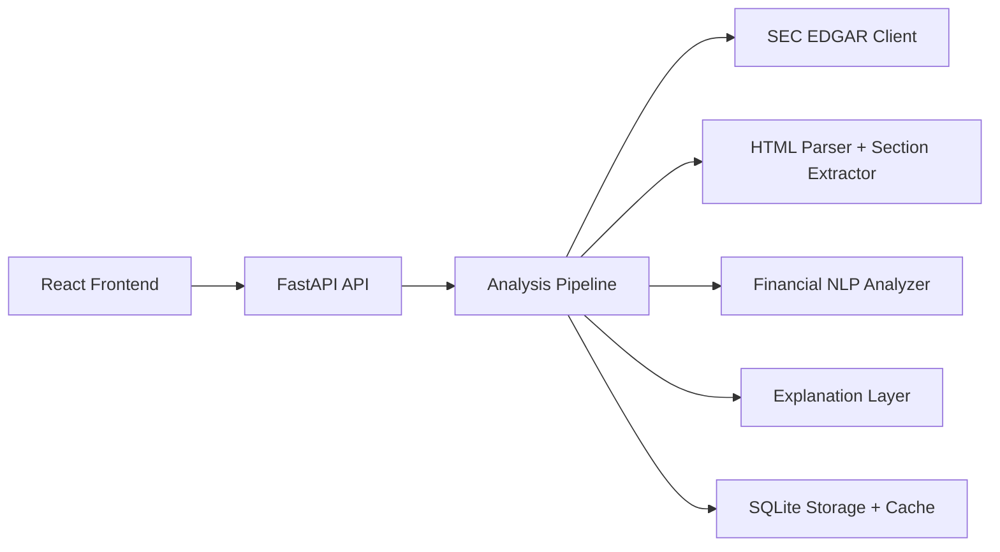

# EDGAR RiskLens Technical Report

EDGAR RiskLens is a full-stack financial NLP system for analyzing public SEC filings. It fetches a company's latest filing, parses the document, scores sentiment and risk language, extracts supporting evidence, and presents the result in a React dashboard.

The goal is not to predict stock prices. The goal is to help users read long financial documents faster while keeping the output explainable enough that a human can inspect the language behind each score.

## 1. Field Context

Public companies disclose important business information through filings such as `10-K`, `10-Q`, `8-K`, `20-F`, and `6-K`. These documents contain management discussion, risk factors, market-risk disclosures, material events, and legal or operational warnings.

In practice, these filings are useful but difficult to consume. A single annual report can be hundreds of pages long, and the most important language is often buried inside formal legal text. Financial NLP is useful here because it can turn unstructured filing text into structured signals: sentiment, uncertainty, risk density, risk categories, and cited evidence.

This project focuses on SEC filings rather than earnings call transcripts because SEC filings are public, official, and accessible without buying data. That matters for a portfolio-grade system: the project can run from live public data instead of depending on a private dataset or a paid transcript provider.

## 2. Problem Statement

The system answers a practical question:

```text
Given a company ticker and filing type, what does the latest public filing suggest about tone, risk, and uncertainty, and where in the filing did those signals come from?
```

The challenge is not only classification. A useful system must also:

- fetch the right filing reliably from SEC EDGAR
- clean noisy HTML into readable text
- identify important filing sections when possible
- produce scores that are understandable
- cite excerpts so users can verify the result
- avoid repeatedly reprocessing the same large filing
- present the result in a clean interface

The core design choice is explainability over model complexity. A black-box model may produce a score, but this project is built so users can see the matched terms, filing excerpts, sections, and risk categories behind the output.

## 3. System Overview

The application has four main layers:



The frontend lets the user choose a company and filing type. The backend receives the request, resolves the ticker to a SEC CIK, finds the latest matching filing, checks whether that exact accession number has already been analyzed, and either returns the cached result or processes the filing from scratch.

## 4. Data Fetching

The SEC client is responsible for turning a ticker into a document URL. The important flow is:

1. Resolve ticker to CIK using SEC company ticker metadata.
2. Load the company's recent submissions JSON.
3. Filter recent filings by form type.
4. Build the final SEC archive URL from CIK, accession number, and primary document.
5. Download the filing HTML only if it is not already cached.

Important functions:

- `SECClient.get_cik_for_ticker(...)`
- `SECClient.get_recent_filings(...)`
- `SECClient.build_document_url(...)`
- `SECClient.download_filing(...)`

The backend also sets a descriptive SEC `User-Agent` and waits briefly between SEC requests. This is a small but important engineering detail because SEC systems expect automated clients to identify themselves and behave politely.

## 5. Parsing And Section Extraction

SEC documents are usually HTML, not clean plain text. The parser removes script/style noise, converts the document into text, normalizes whitespace, and then searches for major filing sections.

Important functions:

- `FilingParser.clean_text(...)`
- `FilingParser.extract_sections(...)`

The parser currently detects sections such as:

- `Item 1A - Risk Factors`
- `Item 7 - Management Discussion and Analysis`
- `Item 7A - Market Risk`
- `Item 3.D - Risk Factors` for foreign issuers
- selected `8-K` event sections

Section extraction makes the analysis more useful because a whole-document score is often too broad. A filing can look low risk overall while a specific section contains concentrated risk language.

## 6. NLP Scoring Method

The first version uses finance-focused dictionary scoring. This is intentional. It keeps the baseline transparent, testable, and easy for beginner-to-mid-level developers to maintain.

The analyzer counts four groups of terms:

- positive terms such as `growth`, `improved`, `profit`, `strong`
- negative terms such as `loss`, `decline`, `impairment`, `weakness`
- risk terms such as `litigation`, `default`, `regulatory`, `breach`
- uncertainty terms such as `may`, `could`, `uncertain`, `subject to`

The risk and uncertainty scores are density scores:

```text
score = matched term count / total words * 1,000
```

This means a risk score of `6.00` means roughly six matched risk terms per 1,000 words. It is not a probability and not a stock forecast.

Current risk thresholds:

```text
Low:    below 5 risk terms per 1,000 words
Medium: 5 to below 12 risk terms per 1,000 words
High:   12 or more risk terms per 1,000 words
```

Important functions:

- `FinancialTextAnalyzer.analyze(...)`
- `FinancialTextAnalyzer._sentiment_score(...)`
- `FinancialTextAnalyzer._risk_level(...)`
- `FinancialTextAnalyzer._risk_category_scores(...)`
- `FinancialTextAnalyzer._section_analyses(...)`

Short implementation example:

```python
risk_score = round((risk_total / token_total) * 1000, 4)
uncertainty_score = round((uncertainty_total / token_total) * 1000, 4)
```

## 7. Risk Categories

The project goes beyond one generic risk score by grouping risk into business themes:

- litigation risk
- regulatory risk
- liquidity risk
- market risk
- cybersecurity risk
- operational risk

Each category has its own term list and score. This gives users a clearer answer than "risk is medium." For example, two companies can both have medium risk, but one may be driven by litigation language while another is driven by market-risk language.

This is a practical explainability feature. It helps the frontend show not only how risky the filing looks, but what type of risk is driving the result.

## 8. Evidence Extraction

A score without evidence is not very useful. EDGAR RiskLens extracts short filing excerpts that contain the strongest matched terms. Each excerpt includes:

- excerpt text
- matched terms
- relevance score
- source section when detected
- link back to the SEC filing

Important function:

- `FinancialTextAnalyzer._extract_excerpts(...)`

The frontend highlights matched terms inside each excerpt. This creates a simple audit trail: users can look at the score, then read the actual filing language behind it.

## 9. Explanation Layer

The explanation layer turns structured outputs into plain English. By default, it uses a template explanation so the project works without a paid LLM key. OpenAI support is optional and can be enabled through environment variables.

The rule is strict: the explanation should summarize supplied scores, evidence, and sections. It should not invent outside facts, give investment advice, or predict price movement.

This design keeps the project useful without making it dependent on paid API access.

## 10. Caching And Storage

SQLite is used for two jobs:

- storing completed full analysis results
- caching lightweight risk-trend points

The cache key is the SEC accession number plus ticker and form type. This matters because accession numbers uniquely identify filings. If the latest filing has already been analyzed, the backend can return the saved result instead of downloading and parsing the same document again.

Important functions:

- `AnalysisStore.save(...)`
- `AnalysisStore.get_analysis(...)`
- `AnalysisStore.save_trend_point(...)`
- `AnalysisStore.get_trend_point(...)`

The pipeline still checks SEC metadata first. That means the app does not blindly return stale data; it first asks SEC what the latest filing is, then checks whether that exact filing is already cached.

Short implementation example:

```python
metadata = self.ingestor.get_latest_metadata(ticker, form_type)
cached_result = self.store.get_analysis(
    metadata.ticker,
    metadata.form_type,
    metadata.accession_number,
)
if cached_result:
    return cached_result
```

## 11. Pipeline Flow

The main backend workflow is handled by `FilingAnalysisService`.

For a single filing:

```text
analyze_latest(ticker, form_type)
  -> get latest filing metadata
  -> check SQLite cache by accession number
  -> download filing if cache miss
  -> clean and parse text
  -> score sentiment, risk, uncertainty
  -> extract evidence and sections
  -> generate explanation
  -> save result
  -> return API response
```

For the trend chart:

```text
analyze_risk_trend(ticker, form_types, limit)
  -> get recent filing metadata
  -> reuse cached trend points when available
  -> analyze missing filings
  -> sort points by filing date
  -> return chart-ready response
```

This keeps the backend readable while still showing real system design: ingestion, parsing, NLP, explanation, caching, and API response formatting are separate concerns.

## 12. Selected Implementation Snippets

These snippets are intentionally short. They show the core engineering ideas without forcing readers to inspect the full codebase first.

Clean SEC HTML into readable text:

```python
soup = BeautifulSoup(html_or_text, "html.parser")
for tag in soup(["script", "style", "noscript"]):
    tag.decompose()

text = soup.get_text(separator=" ").replace("\xa0", " ")
clean_text = re.sub(r"\s+", " ", text).strip()
```

Build a direct SEC archive URL:

```python
cik_without_padding = str(int(cik))
accession_without_dashes = accession_number.replace("-", "")
document_url = (
    f"{sec_www_base_url}/Archives/edgar/data/"
    f"{cik_without_padding}/{accession_without_dashes}/{primary_document}"
)
```

Return chart points in chronological order:

```python
points.sort(key=lambda point: point.filed_at)
return RiskTrendResponse(ticker=ticker.upper().strip(), points=points)
```

## 13. Frontend Design

The frontend is a React + TypeScript dashboard. It is intentionally built as a product interface rather than a notebook output.

Key UI features:

- searchable company selector with ticker, exchange, country, sector, and logo
- filing type selector that changes based on issuer type
- metric cards for sentiment, risk, and uncertainty
- executive summary with emphasized company, date, scores, and risk keywords
- risk trend chart across recent filings
- risk category and section-signal panels
- cited excerpts with matched-term highlighting
- recent analyses table

The UI is designed to make the analysis easy to scan. The system does not force users to read raw JSON or long terminal output.

## 14. Engineering Decisions

The most important decisions are:

- Use SEC filings because they are public, official, and not paywalled.
- Keep dictionary-based NLP as the first model because it is explainable and testable.
- Use section-aware scoring so the system can show where risk appears.
- Use cited excerpts because users need evidence, not just a score.
- Make LLM explanations optional so the app runs without paid access.
- Use SQLite caching before adding heavier infrastructure.
- Keep the repo layered but small so the code stays maintainable.

These choices make the project stronger as an engineering portfolio piece. It demonstrates data access, backend design, NLP, explainability, caching, testing, deployment, and frontend presentation without becoming unnecessarily complex.

## 15. Limitations

The current model is a transparent baseline, not a final financial model.

Known limitations:

- Dictionary scoring can miss context and negation.
- Some filings have unusual HTML structures that may affect section extraction.
- Scores are language-density indicators, not investment recommendations.
- The system does not yet benchmark against labeled financial sentiment data.
- SQLite is suitable for this project scale but not ideal for heavy multi-user traffic.

These limitations are acceptable because the project prioritizes an understandable end-to-end system. Future versions could add FinBERT, labeled evaluation data, raw filing caching, or a Postgres-backed production storage layer.

## 16. Summary

EDGAR RiskLens is a practical financial NLP system that turns public SEC filings into explainable risk intelligence. It does not hide behind a black-box score. It shows the filing, the score, the evidence terms, the risk categories, the sections, and the excerpts.

That is the main engineering value of the project: it is not just sentiment analysis. It is a small, maintainable, deployed system for explainable financial document analysis.
